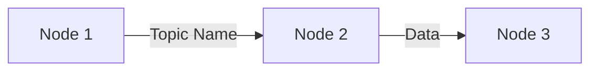
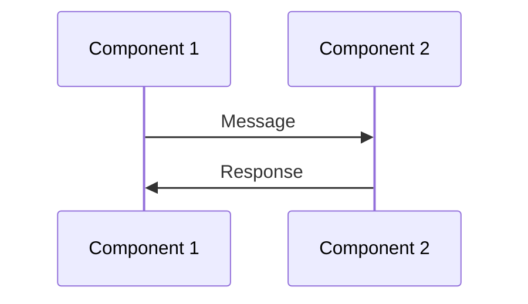

# Chapter Writer Quick Reference

> **Related Skill**: See `chapter-writer.md` for full patterns and detailed guidance

## 30-Second Chapter Checklist

Before submitting a chapter, verify:

- [ ] **Frontmatter**: 6 fields (id, title, sidebar_label, sidebar_position, description, keywords)
- [ ] **Learning Objectives**: Exactly 4, using action verbs (Explain, Describe, Identify)
- [ ] **Word Count**: 850-950 target (acceptable: 700-1,150)
- [ ] **Reading Level**: Grade 5-6 (short sentences, simple words)
- [ ] **Admonitions**: 2-4 total (:::note, :::tip, :::warning)
- [ ] **Examples**: 2+ humanoid robot scenarios
- [ ] **Analogies**: 1-2 everyday life parallels
- [ ] **Diagrams**: 0-2 Mermaid diagrams with captions
- [ ] **Terms**: All technical terms **bolded** and defined inline
- [ ] **Checkpoint**: 3 quiz questions with answers at end
- [ ] **Glossary**: Key terms added to docs/glossary.md
- [ ] **Cross-refs**: References to previous/next chapters

## Structure at a Glance

```
Frontmatter (YAML)
# Chapter Title
## Learning Objectives (4 items)
---
## Section 1: Introduction/Motivation (100-150 words)
---
## Section 2: Core Concept (250-350 words)
  :::note Key Concept
---
## Section 3: Deeper Dive (250-350 words)
  :::warning Common Misconception
---
## Section 4: Real-World Examples (150-250 words)
  :::tip Practical Guidance
---
## Summary (100-150 words)
  :::tip Learning Checkpoint (3 questions + answers)
```

## Word Count Targets by Section

| Section | Target Words | Flex Range |
|---------|-------------|------------|
| Introduction | 100-150 | 80-200 |
| Core Concept | 250-350 | 200-400 |
| Deeper Dive | 250-350 | 200-400 |
| Examples | 150-250 | 100-300 |
| Summary | 100-150 | 80-200 |
| **Total** | **850-950** | **700-1,150** |

## Common Action Verbs for Learning Objectives

| Level | Verbs | Example |
|-------|-------|---------|
| **Remember** | Identify, List, Name, Recognize | "Identify the three joint types in URDF" |
| **Understand** | Explain, Describe, Summarize, Compare | "Explain how topics differ from services" |
| **Apply** | Use, Demonstrate, Implement, Solve | "Determine which pattern fits a scenario" |
| **Analyze** | Differentiate, Distinguish, Examine | "Distinguish between links and joints" |

Use: 2 Understand + 1 Remember + 1 Apply/Analyze

## Admonition Quick Guide

| Type | When to Use | Example |
|------|-------------|---------|
| **:::note** | Critical takeaway | "Topics use publish-subscribe pattern..." |
| **:::warning** | Common misconception | "Links don't move by themselves..." |
| **:::tip** | Decision guide | "Use topics for continuous data..." |

**Frequency**: 2-4 total per chapter (1-2 notes, 0-1 warning, 1-2 tips)

## Example Patterns

### Analogy Pattern
```
Think about [everyday situation]. [How it works].
[Parallel to concept].

ROS 2 [concept] works the same way: [mapping]
```

**Example**: "Think about posting on social media. You broadcast
information to anyone listening. ROS 2 topics work the same way:
publishers broadcast data to any subscribers."

### Robot Example Pattern
```
Imagine a humanoid robot [doing task]:

1. [Sensor] [action] [frequency/detail]
2. The [sensor node] **publishes** [data] to "[topic name]"
3. A [processing node] **subscribes** to "[topic]" and [processes]
4. [Additional nodes] also subscribe to [show flexibility]
5. [Result/benefit of the pattern]
```

### Term Definition Pattern
```
A **[term]** is [simple definition in one sentence].

[Additional detail sentence].

[Example sentence using the term].
```

**Example**: "A **node** is an independent program that does one
specific job. Each node runs separately and communicates through
ROS 2. A camera node captures images while a vision node processes them."

## File Naming Conventions

| Type | Pattern | Example |
|------|---------|---------|
| Chapter | `chapter{N}-{slug}.mdx` | `chapter3-communication.mdx` |
| ID | `chapter{N}-{slug}` | `chapter3-communication` |
| Sidebar Label | Short (1-2 words) | `"Communication"` |
| Title | Full descriptive | `"Chapter 3: Communication Patterns"` |

## Mermaid Diagram Cheat Sheet

### Linear Flow


### Sequence Diagram


**Always add caption**: `*Figure N: [Description]*`

## Terminology Consistency

| Correct | Incorrect |
|---------|-----------|
| ROS 2 | ROS2, ros2 |
| node | Node (when common noun) |
| publish-subscribe | publish subscribe, pub-sub |
| Quality of Service (QoS) | QOS, qos |
| rclpy | RCLPY, RclPy |
| URDF | urdf, Urdf |

## Cross-Reference Templates

**Reference Previous**:
- "In Chapter {N}, you learned {brief concept}. Now..."
- "Remember from Chapter {N} that {concept}..."

**Forward Reference**:
- "In the next chapter, you'll learn about {topic}..."
- "We'll explore this in detail in Chapter {N}."

**Same Chapter**:
- "We'll explore this communication in detail in Chapter 3."
- "As discussed earlier, {brief recap}..."

## Learning Checkpoint Template

```markdown
:::tip Learning Checkpoint
Before continuing, test your understanding:
1. [Question testing recall of main concept]
2. [Question testing application to scenario]
3. [Question testing comparison/distinction]

*Answers: 1=[5-10 word answer], 2=[5-10 word answer], 3=[5-10 word answer]*
:::
```

## Glossary Entry Template

```markdown
### [Term]
**Definition**: [1-2 sentence definition]

**Example**: [Humanoid robot example showing term in context]

**First Introduced**: Module {N}, Chapter {N}
```

## Reading Level Self-Check

**Grade 5-6 indicators**:
- ✅ Average sentence length: 10-20 words
- ✅ Simple subject-verb-object structure
- ✅ One idea per sentence
- ✅ Common words (avoid: utilize → use, commence → start)
- ✅ Active voice (The node publishes, not: Data is published)

**Red flags** (too complex):
- ❌ Sentences over 25 words
- ❌ Multiple clauses with semicolons
- ❌ Passive voice frequently
- ❌ Undefined jargon
- ❌ Academic tone ("Furthermore," "Moreover," "Nevertheless")

## 5-Minute Quality Pass

1. **Read aloud**: Sounds conversational? ✓
2. **Check bold**: Every technical term defined on first use? ✓
3. **Count admonitions**: 2-4 total? ✓
4. **Scan examples**: 2+ robot scenarios? ✓
5. **Verify checkpoint**: 3 questions with answers? ✓

## Common Fixes

| Problem | Quick Fix |
|---------|-----------|
| Too short (< 700 words) | Add second example per main concept |
| Too long (> 1,150 words) | Remove redundant explanations, tighten sentences |
| Too abstract | Add specific robot scenario with sensor→AI→motor flow |
| Too technical | Replace complex terms, add analogies, shorter sentences |
| Inconsistent terms | Grep existing chapters, match their usage exactly |
| No context | Add "In Chapter X..." and "next chapter" references |

## Version Control

When updating this quick reference, also update:
- [ ] Full skill file (`chapter-writer.md`)
- [ ] Document version and date in both files
- [ ] Note what patterns changed and why

---

**Last Updated**: 2025-12-04
**Based On**: Module 1 chapters (5 chapters, 6,792 words)
**Full Guide**: See `chapter-writer.md` for detailed patterns and examples
