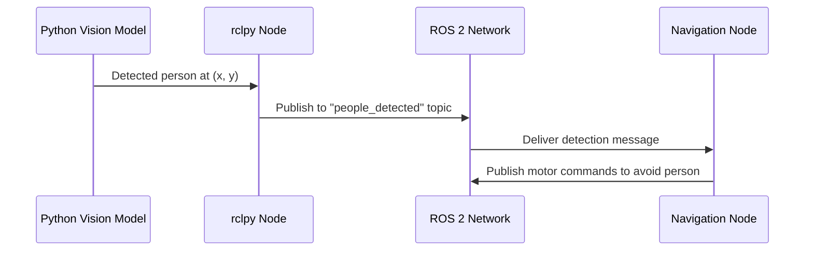

# Chapter 4: Connecting AI with rclpy

## Learning Objectives

By the end of this chapter, you will be able to:

1. Explain what rclpy is and why it's important for AI-robot integration
2. Describe why Python is the dominant language for AI systems
3. Explain how Python AI code becomes a ROS 2 node using rclpy
4. Trace the flow from an AI model to robot hardware through ROS 2

---

## The AI-Robot Connection Challenge

Modern humanoid robots use powerful AI systems for vision, language understanding, and decision-making. These AI systems are usually written in Python using libraries like PyTorch or TensorFlow. But ROS 2 itself is written in C++. So how do Python AI programs talk to robots?

This is where **rclpy** comes in. Think of rclpy as a bridge between Python and ROS 2. It lets your Python AI code become a ROS 2 node that can send and receive messages just like any other node in the system.

Without rclpy, connecting AI to robots would require complex custom code. With rclpy, your PyTorch vision model can publish object detections to a topic, and your robot's navigation system can subscribe to that topic and use the information - all in just a few lines of Python code.

:::note Key Concept
rclpy is the Python client library for ROS 2. It allows Python programs to become ROS 2 nodes and communicate with other parts of the robot system.
:::

---

## Why Python for AI?

You might wonder: why is AI code written in Python instead of C++ like ROS 2? The answer lies in the AI ecosystem.

**1. Dominant AI Libraries**
Nearly all major machine learning frameworks are designed for Python:
- **PyTorch** (used by Meta, Tesla, and thousands of researchers)
- **TensorFlow** (developed by Google)
- **scikit-learn** (for traditional machine learning)
- **Transformers** (for language models like GPT)

These libraries make it easy to train neural networks, process images, and understand language. While they have C++ backends for speed, they're designed to be used from Python. When Tesla develops vision systems for their Optimus robot, they use PyTorch. When Boston Dynamics experiments with new AI capabilities, they work in Python.

**2. Fast Prototyping**
Python code is easier to write and modify than C++. When researchers experiment with new AI algorithms, they can test ideas quickly in Python. This matters because AI research moves fast - new techniques emerge constantly.

In C++, you might spend hours setting up a program just to test one idea. In Python, you can test the same idea in minutes. For AI research where you're trying dozens of approaches to find what works, this speed difference is crucial.

**3. Huge Community**
Millions of developers write Python AI code. When you search for "how to detect objects with deep learning," you'll find thousands of Python examples. This community creates tutorials, tools, and pre-trained models that make building AI systems much easier.

Want to recognize objects? Someone has already trained a model you can download. Need to understand speech? There are pre-trained models for that too. This sharing culture means you don't have to build everything from scratch.

**4. Data Science Integration**
AI systems need data - lots of it. Python has powerful tools for working with data: NumPy for arrays, Pandas for tables, Matplotlib for visualization. These tools integrate seamlessly with AI libraries.

When you're training a vision model, you need to load thousands of images, process them, analyze the results, and visualize what the model learned. Python makes all of this straightforward.

So the reality is: AI lives in Python. Robots need ROS 2. And rclpy connects them.

---

## How rclpy Works

Here's the basic idea: rclpy turns your Python program into a ROS 2 node.

Remember from Chapter 2 that a node is an independent program that does one job and communicates through ROS 2. When you use rclpy, your Python script becomes exactly that - a node that can publish messages, subscribe to topics, call services, and do everything other ROS 2 nodes can do.

**The Bridge Concept:**
```
Python AI Model → rclpy → ROS 2 Network → rclpy → Robot Hardware
```

Let's trace a real example: a vision system detecting people.

1. **Python AI Code**: A PyTorch neural network processes camera images and detects people's positions
2. **rclpy Publisher**: The Python code uses rclpy to publish detections to a "people_detected" topic
3. **ROS 2 Network**: The detection messages flow through ROS 2 to any node that needs them
4. **Navigation Node**: A C++ navigation node subscribes to "people_detected" and avoids walking near people
5. **Motor Controllers**: Based on the navigation commands, motors move the robot safely

The Python AI code doesn't need to know anything about C++, motor controllers, or low-level hardware. It just publishes its detections using rclpy, and the rest of the system receives them.



*Figure 1: How an AI vision model communicates with navigation through rclpy*

---

## Real-World AI Integration Examples

Let's look at how rclpy enables AI systems in real humanoid robots:

**Example 1: Vision-Based Navigation**
A humanoid robot uses a PyTorch object detection model to navigate:
- A camera node captures images and publishes them to a "camera/image" topic
- A Python node with rclpy subscribes to camera images
- The PyTorch model detects objects (chairs, doors, people)
- The same Python node publishes detections to an "objects_detected" topic
- A navigation node (written in C++) subscribes to detections and plans a safe path
- Leg controllers execute the path

The PyTorch model never directly controls motors - it just publishes what it sees. The navigation system handles the actual walking. This separation keeps the AI code simple.

This approach is powerful because you can improve the vision model without touching any navigation or motor control code. If a new PyTorch model comes out that detects objects better, you just swap it in. As long as it publishes the same message format to the same topic, everything else keeps working.

**Example 2: Grasp Planning with AI**
When a robot needs to pick up an object:
- A vision model identifies the object and estimates its 3D position
- A grasp planning AI (also Python + PyTorch) predicts where to grip the object
- The Python code uses rclpy to publish the grip position as a goal
- An arm controller node receives the goal and moves the arm to that position
- Force sensors in the gripper measure contact pressure
- A gripper control node adjusts finger pressure based on the object

The AI handles the "what" and "where" of grasping - what object to pick up and where to grip it. The hardware controllers handle the "how" - actually moving motors smoothly and safely. The AI doesn't need to know about motor voltages, joint limits, or servo control loops. It just says "grip here" and the hardware makes it happen.

**Example 3: Voice Control**
A humanoid robot responds to voice commands:
- An audio node captures microphone input
- A Python node with rclpy runs a Whisper speech recognition model
- The transcribed text is published to a "speech_text" topic
- Another Python node runs a language understanding model (like BERT)
- Recognized intents ("go to kitchen," "pick up cup") are published as action goals
- Action server nodes execute the physical tasks

All of this is glued together by rclpy turning Python AI code into ROS 2 nodes.

---

## Summary

rclpy is the bridge between Python AI systems and ROS 2 robots. It's essential because AI research and development happens primarily in Python using frameworks like PyTorch and TensorFlow, while robots run on ROS 2.

With rclpy, Python code becomes a ROS 2 node that can publish data, subscribe to topics, and integrate seamlessly with the rest of the robot system. This lets AI researchers focus on improving models without worrying about low-level robot hardware, while robot engineers can use cutting-edge AI without rewriting everything in C++.

In the next chapter, you'll learn about URDF - how robots describe their physical structure so that motion planning and simulation systems know how the robot's body is built.

:::tip Learning Checkpoint
Before continuing, explain:
1. What is rclpy and what does it do?
2. Why is most AI code written in Python?
3. How does a Python PyTorch model send data to a robot's motors?
4. Can you describe one AI integration example using rclpy?
:::
